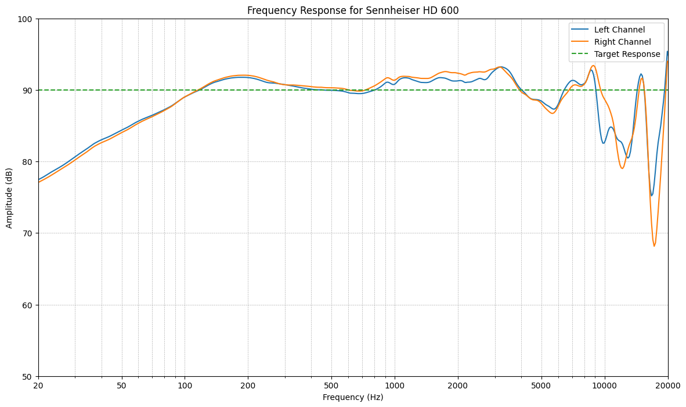
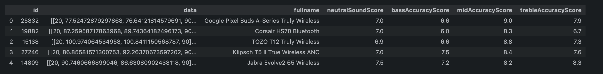

# Automated headphone performance scoring 
Author: [Author Name] 

## Problem description

In the world of audio, especially among headphone audiophiles, sound quality is often judged through a combination of subjective reviews and an objective evaluation of frequency response measurements.

As a beginner audiophile, when browsing reviews online, I found the process of evaluating headphones intriguing, especially in the case of RTINGS.com [^1].
I noticed that they provide scores for different aspects of sound performance, and the website also provides tools to inspect the frequency response.


*RTINGS.com score example*

My interest in this subject, combined with the availability of data, sparked the idea to use this data and attempt to "automate" some aspects of the review process.
This project is of particular interest to me because the core of the "review problem" touches on the timeless debate of subjective versus objective evaluations, which has always fascinated me.

So let's establish the goals for this project:
- Explore the frequency response data, learn more about this domain of evaluation, and see how RTINGS.com uses it
- Predict performance scores from frequency response data
- Generate text descriptions for performance scores 

These models and tools could be helpful for reviewers, audio enthusiasts, and consumers.
Ultimately, it depends on the quality and usefulness of our predictions and descriptions.
We will explore the usefulness of our models and tools as we progress through the project.
Finally, this project is a "fun-and-learning" experience for me.

Let's establish the scene for the data used in this project, collect it and evaluate it.

## Data

**The full scripting setup is available in the accompanying `GitHub` repository, inside the `scripts` workspace folder. Please follow the `README.md` instructions inside the folder.**


Frequency response [^2] measurements show how headphones reproduce sound across different frequencies.
These data are particularly important for audiophiles who are passionate about objectively "high-quality" audio. Frequency response measurements, representing the objective side, provide a quantitative assessment of headphone sound reproduction, allowing for comparisons across headphone models. Significant research, like the Harman Target Curve [^3], has established an ideal frequency response for headphones.
"Objectivist" reviewers and users on Audio Science Review [^4] take a more analytical approach, while others might focus on the subjective and emotional impact of the sound.

"Subjectivist" reviewers, tend to reflect on personal preferences and listening experiences and often use unique "audiophile" terms [^5] - some well-established, others more obscure.

Most popular reviewers seem to attempt to divide their reviews into sections. First evaluating the frequency response objectively, then providing a subjective assessment.
Conveniently, RTINGS.com provides us with data for both sides - the data for this project was sourced directly from RTINGS.com.

The scraping process was complex, involving multiple pages, sub-pages, and APIs. The data model was reverse-engineered from the review database API, including internal IDs, URLs, labeling conventions, and JSON structures.

For consistency, only data from headphones tested with `v1.5`, `v1.6`, and `v1.7` of the RTINGS.com testing protocol [^6] was scraped. These versions are the most recent and comparable. The resulting data consists of several JSON files, including:

Raw headphone product database with over 400 headphones tested using the selected protocols:


*Preview of the headphones' database JSON*

Headphone score data, including the Neutral Sound score, Bass, Mid, and Treble Accuracy scores, and text descriptions:


*Preview of the scores JSON*

Frequency response data for each headphone, including Frequency, Left and Right channel measurements, and Target Response. The resulting JSON file is over 1,000,000 lines long:


*Preview of the frequency response JSON*

The resulting data is well organized, structured, reliable and collected by professionals.
This is definitely one of the better datasets I have worked with, in terms of organization and quality. 

Let's dive into data exploration.

## Data exploration

**The data workflow code for this section is available in the accompanying `GitHub` repository, inside the `notebooks` workspace folder. See the `exploration.ipynb` notebook. Please follow the `README.md` instructions inside the folder.**

### Frequency response data 

After initial inspection and cleaning, the dataset is now pristine, without any missing values:


*Preview of the transformed frequency response data*

With this, we proceed to compute summary statistics:


*Preview of the frequency response data summary statistics*

Now, let's visualize the frequency response. We'll plot the frequency response for the Sennheiser HD 600 [^7] - widely regarded as one of the best price-to-performance reference headphones. Our plot will show samples for frequencies within the human hearing range [^8], from 20 Hz to 20 kHz:



*Sennheiser HD 600 frequency response*

If you are a frequent reader of audio reviews, you may notice that our plot looks different compared to those commonly found online, such as on RTINGS.com:


*RTINGS.com Sennheiser HD 600 frequency response plot*

So, what's different here? Each reviewer or review outlet may have a different testing setup and targets, which can lead to varying results. RTINGS.com, for example, performs their scoring [^9] between 20 Hz and 9 kHz. We also need to match the Amplitude axis scale to the RTINGS.com plot. Let's adjust our plot accordingly:


*Corrected Sennheiser HD 600 frequency response plot*

We can also note that RTINGS.com uses specific frequency ranges in their methodology, approximately matching the following:

- Low-Bass: 20 Hz to 60 Hz
- Mid-Bass: 60 Hz to 100 Hz
- High-Bass: 100 Hz to 250 Hz
- Low-Mid: 250 Hz to 500 Hz
- Mid-Mid: 500 Hz to 1 kHz
- High-Mid: 1 kHz to 2 kHz
- Low-Treble: 2 kHz to 6 kHz
- Mid-Treble: 6 kHz to 10 kHz
- High-Treble: 10 kHz to 20 kHz

Let's inspect a few more visualizations to get a better understanding of the data:


*Frequency response comparison between two pairs headphones*


*Average Frequency Response with Standard Deviation*

Evaluating our visualizations, we see that the left and right channels are generally in sync. The average frequency response for both channels shows good overlap, indicating no major differences for most headphones. The standard deviation areas for both channels also overlap significantly, reinforcing this observation.

It looks like, on average, the headphones' frequency responses are close to the target response, with deviations more prominent at lower frequencies (below 250 Hz) and higher frequencies (above 2 kHz). These deviations could be due to design and tuning choices made by different manufacturers. In the low-frequency range, the frequency responses tend to be above the target response, indicating an emphasis on bass

Let's move on to the scores' data.

### Scores data 

After initial inspection and cleaning, the dataset is now pristine, without any missing values:


*Preview of the transformed scores data*

With this, we proceed to compute summary statistics:


*Preview of the scores data summary statistics*

Now, let's visualize our scores:


*Preview of the scores distributions*

One interesting aspect of the dataset is the textual descriptions for each score. These are semi-objective interpretations by RTINGS.com reviewers. Let's visualize the most common words in the descriptions using a word cloud:


*Descriptions word cloud*

The distributions of the Neutral Sound score, Mid Accuracy score, and Treble Accuracy score are fairly normal, while the Bass Accuracy score is right-skewed. Median values are high across all scores, indicating generally positive evaluations. Most scores fall within a narrow range, but there are some outliers indicating either poor or superb scores. The Bass Accuracy score has the widest range and most outliers, suggesting it could be the most variable in terms of evaluation.

The word cloud visually shows the prominence of different terms used in the score descriptions.
Key terms like "vocals", "lead", "bass", "mid", "treble" and "instruments" stand out, confirming their importance in the reviews.
Words like "well balanced", "punch", "rumble", and "thump" give additional qualitative insights into the characteristics valued or critiqued in the reviews.
The presence of words like "overemphasized" and "accuracy" could suggest that reviewers often critique deviations from a neutral sound profile.

Let's move on to building our model.

## Solution

### Predicting scores from frequency response data 

**Model development code for this section is available in the accompanying `GitHub` repository, inside the `notebooks` workspace folder. See the `auto-fr.ipynb` notebook. Please follow the `README.md` instructions inside the folder.**

Our first model will attempt to predict headphone performance scores based on frequency response data.
For this task, we will use regression on frequency response data to attempt to predict the following scores from our dataset:
- Neutral Sound score
- Bass Accuracy score
- Mid Accuracy score
- Treble Accuracy score

Regression seems like a suitable approach for this task, as the scores are continuous variables.
The model will be trained on the frequency response data and evaluated using Mean Squared Error and R-squared metrics.

Let's begin by applying our code snippets developed during the exploration phase to load and pre-process the data and prepare it for modeling.
We will apply what we learned about RTINGS.com frequency bands by filtering the data to only include frequencies within the 20 Hz to 9000 Hz range. 
Shuffling is applied to the dataset to ensure randomness in the data distribution.
We then merge the frequency response data with the score data to create a unified dataset for training and testing.
With all these steps done, here is a preview of the final merged dataset:



*Preview of the final merged dataset*

Before we proceed with model training, we need to split the data into training and testing sets. The data is split into an 80-20 ratio for training and testing, respectively. Headphone IDs are also split to enable easy inspection of prediction results on headphones not seen during training.

Our first model is a Random Forest Regressor [^10].
With the model ready, let's visualize our performance metrics and run predictions on a single pair of headphones from the test set to practically see how well our model performs:


*Model 1 performance metrics*


*Model 1 applied prediction*

The first model yields Mean Squared Error of 0.3 and an R-squared of 0.68.
There is room for improvement, but the model shows some promise in predicting scores from frequency response data.
Looking at the applied predictions for a single pair of headphones, we see that the model's predictions are relatively close to the actual scores.

Let's move on to our next model to see if we can improve our predictions.
We experiment with techniques for improving regression models.
This leads us to introduce a scaler [^11] to normalize the data, add grid search [^12] to find the best hyperparameters for the model, and replace the Random Forest Regressor with the Gradient Boosting Regressor, wrapped inside a Multi Output Regressor [^13].

With the improved model prepared, let's run our visualizations again:


*Model 2 performance metrics*


*Model 2 applied prediction*

The new model yields Mean Squared Error of 0.1 and an R-squared of 0.84. This is a significant improvement over the first model.
We can see that the predictions are much closer to the actual scores - the model has learned the patterns in the data reasonably well.

The next step would be to dive into hyperparameter tuning to apply our understanding of RTINGS.com scoring methodology and frequency bands to further improve the model.
However, let's pause here for now and instead dive into the details behind the scores and how exactly RTINGS.com calculates them.

Let's find and examine the details of how the scores in our dataset are calculated:
- Bass Accuracy [^14] score is composed of 95.0% Standard Error for the Bass Range and 5.0% Low-Frequency Extension metric
- Mid Accuracy [^15] score is composed of 100% Standard Error for the Mid-Range
- Treble Accuracy [^16] score is composed of 100% Standard Error for the Treble Range
- Neutral Sound score is composed of 25.0% Bass Accuracy, 25.0% Mid Accuracy, 15.0% Treble Accuracy, 15.0% Passive Soundstage, 8.0% Imaging, 7.0% Weighted Harmonic Distortion, and 5.0% Frequency Response Consistency

We can see that we are lacking data to try to accurately predict the Neutral Sound score and Bass Accuracy score, as they are composed of multiple metrics.
We could incorporate this knowledge into our model to improve predictions further.

But at this point, a question arises: what is the reason for creating a model that is essentially a "black box approximation" when we can directly calculate the scores using the frequency response data?
Serious audio enthusiasts and reviewers apply statistical analysis and make reliable and accurate scoring models themselves, without the need for machine learning.

Instead, let's instead use our knowledge to help reviewers generate the initial text descriptions for their reviews.
After all, the text descriptions are what provide the most value to the readers.

### Generating text descriptions for performance scores

**Test generation code for this section is available in the accompanying `GitHub` repository, inside the `notebooks` workspace folder. See the `auto-description.ipynb` notebook. Please follow the `README.md` instructions inside the folder.**

Having established that scores already incorporate detailed analysis of frequency response data, we can now focus on generating text descriptions for these scores.
This transfers the problem from the regression domain to a prompt engineering domain, as our tool of choice here is an LLM model.

We would like to be able to generate descriptions similar to the descriptions of the reviewers for a single headphone based on the scores.
To achieve this, we will use GPT.
We start by using our proven and tested code snippets to load and pre-process the data.

We then prepare a function that will generate our prompts, depending on the sound aspect we are interested in.
For example, for the Bass Accuracy score, we generate a prompt that finds headphones with the same score, then includes real descriptions from the reviews of these headphones as references, and finally explains how we want the model to generate the text.
We leave the option to customize the `system_content` externally for easy tweaking and experimentation.

This time we experiment with different techniques in prompt engineering [^17].
We break down the prompt into smaller parts and use the Few-shot learning strategy by providing reference descriptions for the model to learn from [^18].

Our Bass Accuracy prompt for may look like this:

``` txt
[CONTEXT]
- Headphone: HiFiMan HE-400i
  - Bass accuracy: 6.9
  - Bass accuracy description: The bass of the HE-400i is very good. The LFE (low-frequency extension) of 54Hz is decent, but not great. Also, low-bass which is responsible for the thump and rumble common to bass-heavy music is lacking by more than 5dB. So their sub-bass may not be heavy enough for the fans of heavy bass. Mid-bass, responsible for the body of bass guitars and the punch of kick drums, is also lacking by about 1dB, but this effect will be very subtle. High-bass, responsible for warmth is quite flat and over our neutral target by just 1dB.

- Headphone: Corsair VOID ELITE
  - Bass accuracy: 6.9
  - Bass accuracy description: The bass accuracy of the Corsair VOID Elite is adequate. It’s underemphasized in the low-bass region, which might rob in-game sound effects of thump and rumble. That’s followed by an overemphasized high-bass, which generates boominess and muddiness in some tracks. That said, these headphones’ bass reproduction is heavily dependent on their fit and positioning, so your own experience may vary significantly.

- Headphone: Amazon Echo Buds True Wireless 2023 (3rd generation)
...

[TASK]
Generate a description of bass performance score for the following headphone based on this data:

- Headphone: Sennheiser HD 600
  - Bass accuracy: 6.9

```

With the prompt ready, we can now use the API to generate text descriptions for the scores.
We will generate descriptions for our target scores: Bass Accuracy, Mid Accuracy, and Treble Accuracy.

Let's compare the generated descriptions with the real descriptions for a selected headphone: 


*Real and generated descriptions comparison*

We can see that the generated descriptions are quite close to the real descriptions but lack details about the specific headphone model.

## Discussion and summary

In this project, we explored the world of headphone performance assessment. We focused on frequency response data and textual reviews, developing models and tools to predict performance scores and generate text descriptions.

The score prediction model did not perform well.
While the second model improved significantly, the predictions were not accurate enough to be useful for this type of data.
The lack of specific metrics for Bass Accuracy and Neutral Sound scores limited the model's accuracy.
We established that the RTINGS.com scores already incorporate detailed analysis of frequency response data, making the regression model redundant.
Alternatively, we could treat this problem as a classification problem to try and improve the model's performance. 
While the model could be improved, the point of creating an improved model is questionable when the scores can be calculated directly from the frequency response data.

Our text description generation, on the other hand, performed well, generating descriptions that matched real descriptions reasonably well. It can already be used to generate placeholder descriptions during the review writing process. Text generation should be the primary focus for the next iteration of this project.

Currently, our two biggest limitations are reliance on a pre-trained LLM and a limited dataset. Our dataset lacks key data points that would allow us to generate more accurate descriptions. The dataset does not contain information about the headphones' type, category, connection method, songs that were used during testing, etc.

These additional data points could be important for generating more accurate descriptions, as these aspects are often mentioned in the descriptions of real reviewers.
We could improve text generation by including this information in the dataset and providing reference descriptions for a specific subset of headphones that match the headphones we are generating descriptions for.

To bypass the pre-trained LLM model limitation, we could also fully commit to building a custom model that generates descriptions based on our own corpus of reviews. We could expand our dataset by scraping more reviews from RTINGS.com, not focusing solely on the scores we've attempted to predict so far. We could also add other sources of review text data and balance them against RTINGS.com to have a sizeable custom corpus. All this data could be used to train a fully customized model. Paired with the already existing statistical model used by RTINGS.com, this could significantly speed up the review writing process. Reviewers would run the frequency response tests, input the data into the model, and get a draft review that they could then polish and publish.

This was a fun and educational project, and my main goal has been achieved - I've learned a lot about the audio review process and the challenges of automating it. 

## Sources

[^1]: [RTINGS.com](https://www.rtings.com/)
[^2]: [Frequency response](https://en.wikipedia.org/wiki/Frequency_response)
[^3]: [Harman Target Curve](https://acousticstoday.org/he-perception-and-measurement-of-headphone-sound-quality-what-do-listeners-prefer-sean-e-olive/)
[^4]: [Audio Science Review](https://www.audiosciencereview.com/forum/index.php)
[^5]: [RTINGS.com Sound Quality Glossary](https://www.rtings.com/headphones/learn/sound-quality-glossary)
[^6]: [RTINGS.com Test Methodology](https://www.rtings.com/headphones/tests/changelogs)
[^7]: [Sennheiser HD 600 Review](https://www.rtings.com/headphones/reviews/sennheiser/hd-600)
[^8]: [Human hearing range](https://en.wikipedia.org/wiki/Hearing_range)
[^9]: [RTINGS.com Sound Profile Scores and Tests](https://www.rtings.com/headphones/tests/sound-quality/sound-profile)
[^10]: [Asst. Prof. Navid Nobani - ML Into with Python](https://github.com/Naviden/ML-intro-with-Python/blob/main/Regression%20Models.ipynb)
[^11]: [scikit learn - Preprocessing data](https://scikit-learn.org/stable/modules/preprocessing.html)
[^12]: [scikit learn - Tuning the hyperparameters of an estimator](https://scikit-learn.org/stable/modules/grid_search.html)
[^13]: [scikit learn - Multi Output Regressor](https://scikit-learn.org/stable/modules/generated/sklearn.multioutput.MultiOutputRegressor.html)
[^14]: [RTINGS.com Bass Accuracy](https://www.rtings.com/headphones/tests/sound-quality/bass-accuracy)
[^15]: [RTINGS.com Mid Accuracy](https://www.rtings.com/headphones/tests/sound-quality/mid-accuracy)
[^16]: [RTINGS.com Treble Accuracy](https://www.rtings.com/headphones/tests/sound-quality/treble-accuracy)
[^17]: [OpenAI - Prompt engineering](https://platform.openai.com/docs/guides/prompt-engineering)
[^18]: [Hugging Face - LLM prompting guide](https://huggingface.co/docs/transformers/main/en/tasks/prompting#llm-prompting-guide)